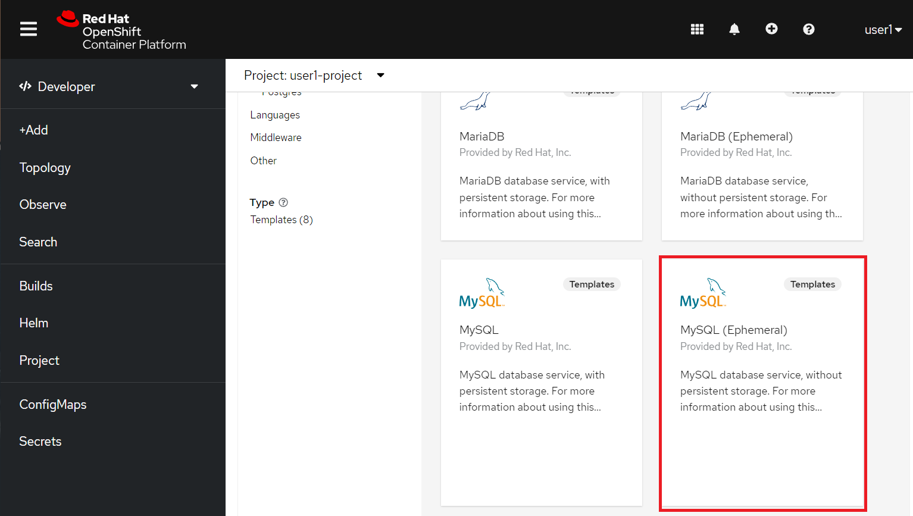
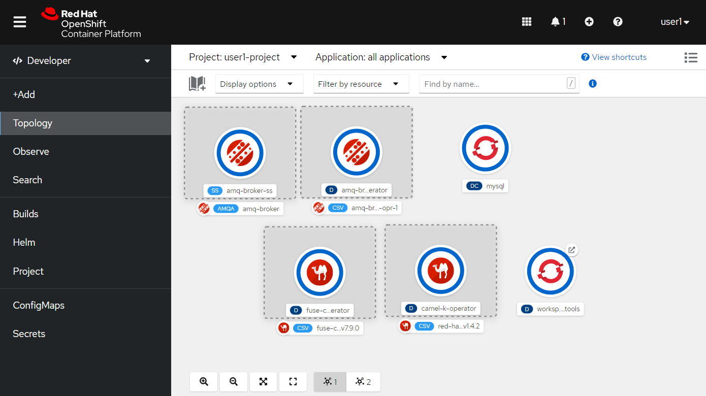
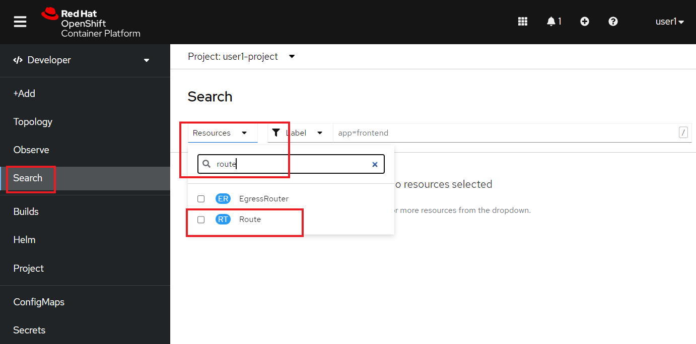
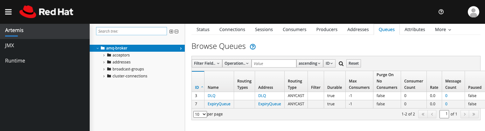

:walkthrough: Publish to Openshift
:codeready-url: {che-url}
:openshift-url: {openshift-host}
:user-password: openshift

= Lab 5 - Publish to OpenShift

There are several ways to deploy an application into OpenShift

. Directly from the git repository using S2I
. From the local machine using binary deployment
. From a Docker image

For this lab we will use the binary deployment option (#2 above), uploading the code directly from the workspace to OpenShift. For it to work, we will need the `oc` client working in our local machine.
In the last section you will see how to use S2I to deploy applications.

[type=walkthroughResource,serviceName=codeready]
.CodeReady Workspaces
****
* link:{codeready-url}[Console, window="_blank"]
* link:https://developers.redhat.com/products/codeready-workspaces/overview[Want to know more about CodeReady Workspaces?, window="_blank"]
****

[type=walkthroughResource,serviceName=openshift]
.OpenShift Console
****
* link:{openshift-url}[Console, window="_blank"]
****

[type=walkthroughResource]
.Fabric8 Maven Plugin
****
* link:https://maven.fabric8.io[Fabric8 Maven Plugin, window="_blank"]
****

[time=5]
== MySQL Database provisioning

First, to work with the MySQL database in production, we have to deploy/provision it.

Go to the link:{openshift-host}[OpenShift Console, window="_blank"].
Click on *Add*  on the left menu.

image::./images/01.png[]

{empty} +

Click on *From Catalog*.

image::./images/02.png[]

{empty} +

Then look for *mysql* and select the *MySQL (Ephemeral)* option.

{empty} +

Click on *Instantiate Template*.

image::./images/04.png[]

Fill out *MySQL Connection Username*, *MySQL Connection Password* and *MySQL root user Password* as *redhat* and then click *Create*.

{empty} +

image::./images/05.png[]

[type=verification]
Were you able to deploy Mysql?

[time=5]
== AMQ provisioning

Let's provisioning an AMQ Broker on this step. As on the previous step, click on *Add* on the left side menu.
Select *Operator Backed* option.

Filter by the *AMQ Broker* option and select *AMQ Broker* option.

image::./images/07.png[]

{empty} +
Click on *Create*.

image::./images/08.png[]

On the configuration select *Yaml view*  and paste the following content:

[source,yaml,subs="attributes+", id="amq-cr"]
----
apiVersion: broker.amq.io/v2alpha4
kind: ActiveMQArtemis
metadata:
  name: amq-broker
  application: amq-broker
  namespace: {user-username}-project
spec:
  deploymentPlan:
    size: 1
    image: >-
      registry.redhat.io/amq7/amq-broker@sha256:a6a2fd548f4e89151a8e7d4bacb7380d0076bbd1b1f5bc5555f2e95e19e1441f
    requireLogin: false
    persistenceEnabled: false
    journalType: nio
    messageMigration: false
    jolokiaAgentEnabled: false
    managementRBACEnabled: true
  adminUser: redhat
  adminPassword: redhat
  console:
    expose: true
----

{empty} +

image::./images/09.png[]

If everything worked fine, you should see a screen like this:

Now, let's open the Management Console of the AMQ Broker. On the left panel, click *Search*. On the resources dropbox, select `Route`.

{empty} +

Click on the Route URL.

image::./images/12.png[]

{empty} +
Click on *Management Console*.

image::./images/13.png[]

Enter the following credentials:

* Username: `redhat`
* Password: `redhat`

image::./images/14.png[]

{empty} +
This is AMQ Console main page. Click on the Queues tab.

image::./images/15.png[]

{empty} +
You may use this page to monitor the queues statistics.

{empty} +

[type=verification]
Were you able to deploy AMQ?

As you can see the Address we need is not created. Follow theses steps to create it. On the left panel, click *+Add* then *Operator Backed*.

image::./images/17.png[]

{empty} +

Click *Create*.

image::./images/18.png[]

{empty} +

Set the *Queue Name* and *Address Name* as `orders`. Leave the *Routing Type* as anycast.

image::./images/20.png[]

{empty} +

Now you will be able to visualize the queue using the web console.

image::./images/21.png[]

[type=verification]
Were you able to deploy the new Queue?

[time=15]
== Application deployment to OpenShift using Binary Deployment

Before using the `fabric8` maven plugin, first we need to log in OpenShift. On the right side panel, execute the `log in openshift` command.

image::./images/lab05-login-command.png[]

Once the login process is done, you should see a similar message.

image::./images/lab05-after-login.png[]

Now that you are logged in, on the right panel, execute the `deploy to openshift` command. This command you build the project locally and push it to OpenShift, where a container image will be created.

image::./images/lab05-deploy-ocp.png[]

The `fabric8:deploy` maven goal uses the oc client authentication under the hood. It also uses a binary deployment, meaning it builds your application binary locally and sends that to OpenShift to "wrap" in a container image & deploy.

After `fabric8:deploy`, take a look in the target folder inside the project. More specifically, look at `target/docker/fuse-workshop/latest/build`. This shows the source of the container that was built.

After the deployment completes you will see that the application is using both the AMQ Broker & the MySQL database deployed on OpenShift. All of the production configuration data is in the `src/main/resources/application-prod.properties` file and we are activating this profile during the deployment within in `src/main/fabric8/deployment.yml` config file. Fabric8 will inject this content inside of the final DeploymentConfig when deploying to Openshift.

[type=verification]
Were you able to deploy the Application?

[time=10]
== Fuse Java Console

Fuse has a web console that enables us to see some data flowing trough the routes, threads, messaging and also to do some debugging. The console is based on the open-source project `Hawtio`, and explore all the JMX exposed metrics
of Red Hat Fuse.

In the OpenShift console right panel, click on *+Add -> Operator Backed*, then select Hawtio.

Click on the `Create` button. You won't need to change anything in the form. Just click `Create` again.

Once the deployment is done, you may access the console's `Route`.

. You will be prompted to log in with username `{user-username}` and password `{user-password}`
. You will be asked to authorize the access. Allow it by clicking `Allow select permissions`.

Once logged in you will see the homepage. You should also see your application registered

Click on the *Connect* button to connect the console to your running application

[type=verification]
Are you able to connect to the application?

Select `Routes` on the side menu and look for the statistics changing. If you would like to generate some data, capture the URL of list all orders as an example and do the following script in your terminal:

[source,bash,subs="attributes+", id="rest-script"]
----
export ROUTE=$(oc get route fuse-workshop -o jsonpath='{.spec.host}' -n {user-username}-project)

while(true); do curl http://$ROUTE/camel/orders; sleep 1; done
----

It will make one request per second, so you have some data to see on the console. You should see the *Completed* number on the *all-orders* route increase.

. Now, click on *Route Diagram*. You will see the route in a more human-readable way, and the count of requests flowing through the routes.
+

. Click on the *Source* tab. This will show the route source code as XML:
+

. Let's try to do some debugging
.. Select the `all-orders` route on the side menu
.. Click on the *Debug* tab

+

.. Click on *Start debugging*
.. Double-click on the `Log` step. A breakpoint should appear on the box.

+

Make another request to get all the orders. You should see a window appear with all the header & body information of the message within the exchange. Now, let's close the debug by clicking *Stop debugging* in the upper-right corner. Otherwise, it will stay stuck until a timeout in every request.

[time=5]
== Application deployment on OpenShift using S2I

Binary deployment is effective when you are doing a lot of changes and do not like to commit to see the results. A very common practice is to deploy the application automatically on each commit. Also s2i is more often used inside CICD pipelines.

Let's deploy the same application but using the S2I strategy.

. In the *Developer View*, click *+ADD*, then select *From Git*.
+
image::./images/lab05-s2i-01.png[]
. Add the repository `https://github.com/GuilhermeCamposo/fuse-workshop.git` and `labs-complete` as the branch reference.
+

. The interface will identify the correct language used by the project. Now set `openjdk-8-ubi8` as the Builder image and `workshop` as the *Application Name* and *Name*. Then click create.
+

. On the build and deploy are done, you will be able to see the container and in the following image. You may try it by click on the Route button.
+
image::./images/lab05-s2i-04.png[]

[type=verification]
Were you able to deploy the application?
